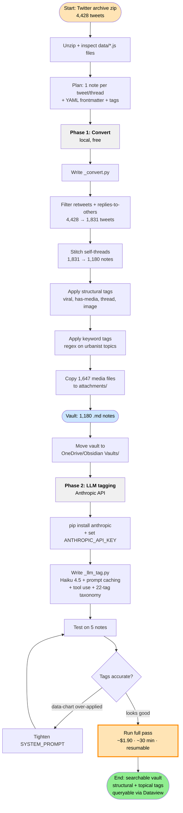

# Workflow: Twitter archive → Obsidian vault

## Where you are now

The orange-outlined node (**Run full pass**) is your current step. Test runs are
done, prompt is tightened, you're ready to kick off the full ~30-minute LLM pass.

## Two-phase summary

**Phase 1 (done):** Local Python conversion — `_convert.py` filtered the archive,
stitched threads, applied regex-based topical tags, and copied media. Output:
1,180 notes ready to use in Obsidian.

**Phase 2 (in progress):** LLM tagging — `_llm_tag.py` sends each note to Claude
Haiku 4.5 to upgrade the keyword-based tags to a curated 22-tag taxonomy.
Structural tags from Phase 1 (viral, has-media, etc.) are preserved.

## Files involved

| File | Purpose |
|---|---|
| `_convert.py` | Phase 1 conversion script |
| `_llm_tag.py` | Phase 2 LLM tagging script |
| `posts/YYYY/*.md` | The notes themselves, organized by year |
| `attachments/*` | Media files (images, videos, GIFs) |
